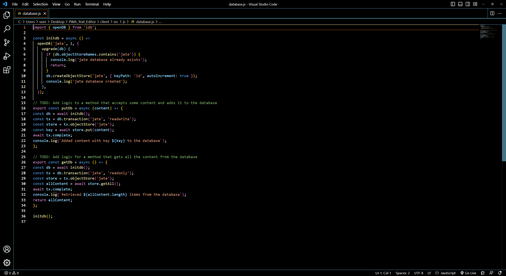
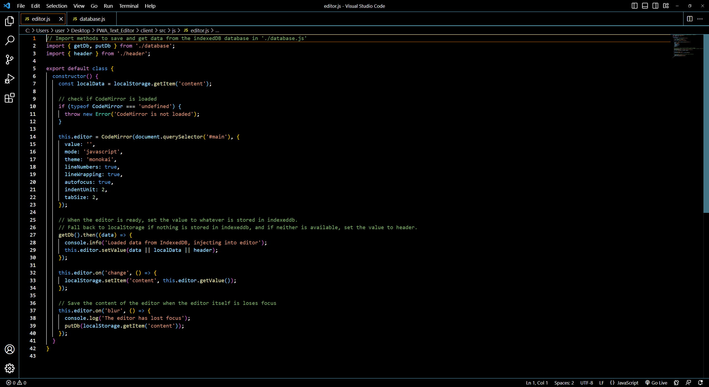
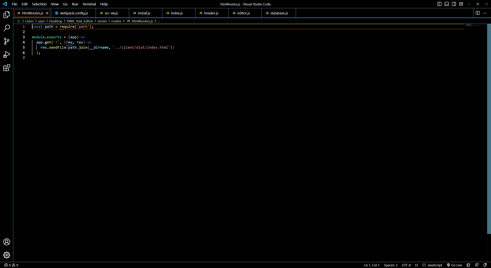
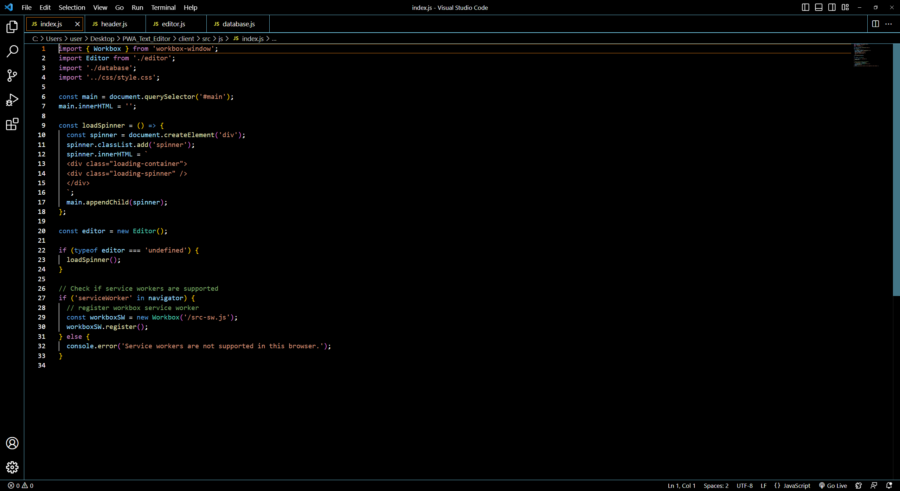
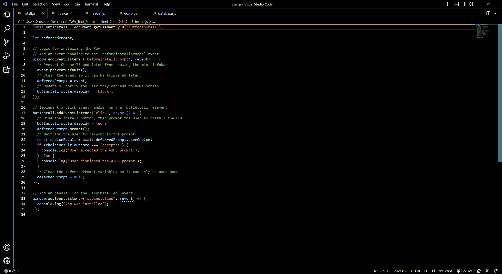
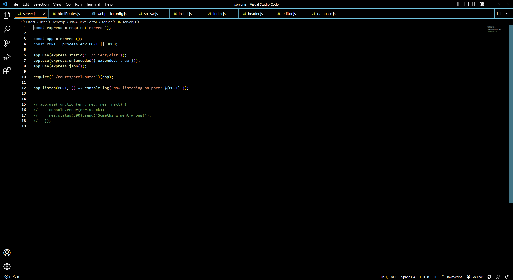
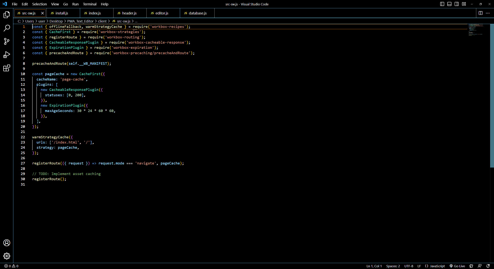
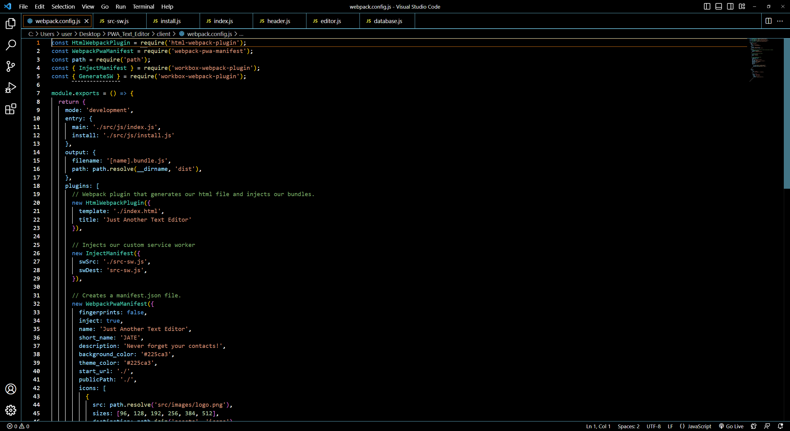

# PWA_Text_Editor

PWA stands for Progressive Web App, which is a web application that uses modern web technologies to provide an app-like experience to users. PWAs are designed to work on any device with a web browser, including desktop computers, smartphones, and tablets.

PWAs offer several benefits over traditional web apps and native mobile apps, such as offline functionality, push notifications, and faster loading speeds. They also allow users to install the app to their device's home screen, making it easily accessible and visible alongside other apps.

To create a PWA, developers use technologies such as Service Workers, which allow the app to work offline and cache content, and Web App Manifests, which provide information about the app such as its name, icon, and theme color.

Overall, PWAs offer a convenient and engaging way for users to access content and services on the web, while also providing developers with a more efficient and cost-effective way to build cross-platform apps

This Repo has has a text editor that runs in the browser.

# Images

# Heroku Link

https://pwa-text-editor-12.herokuapp.com/
